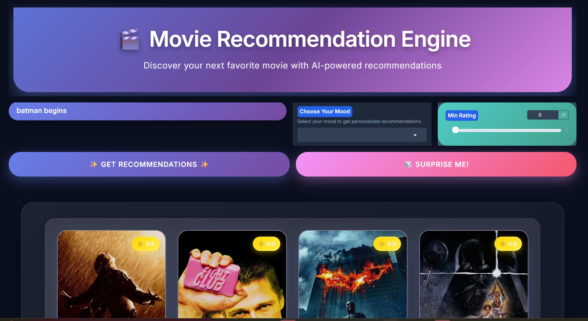
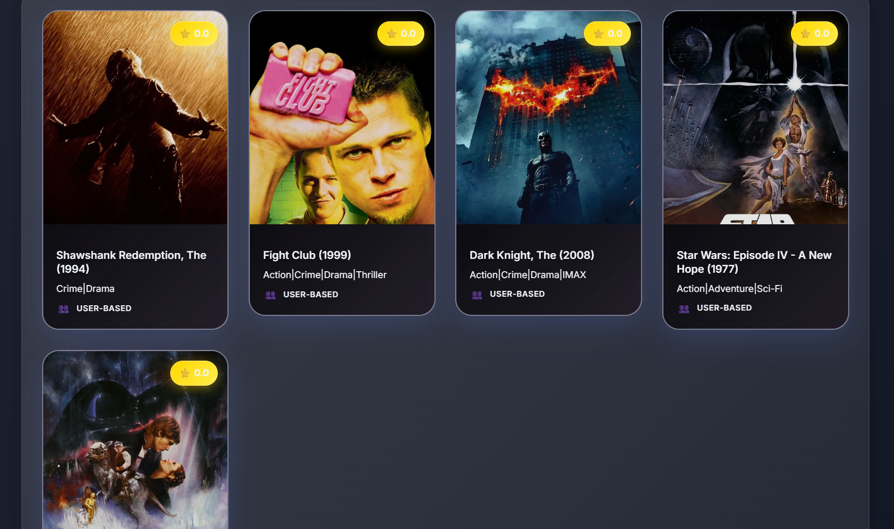
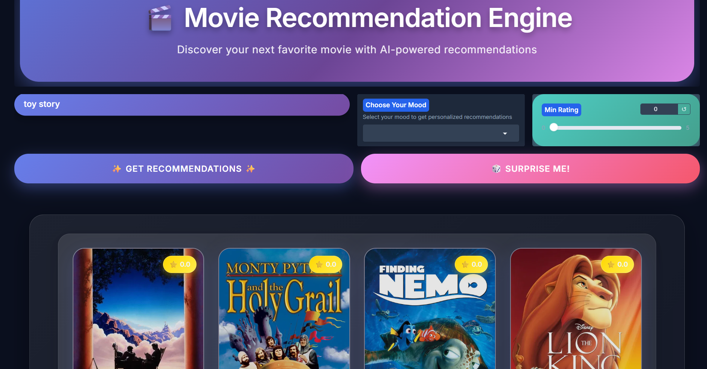
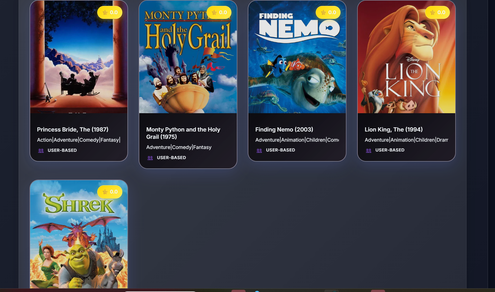
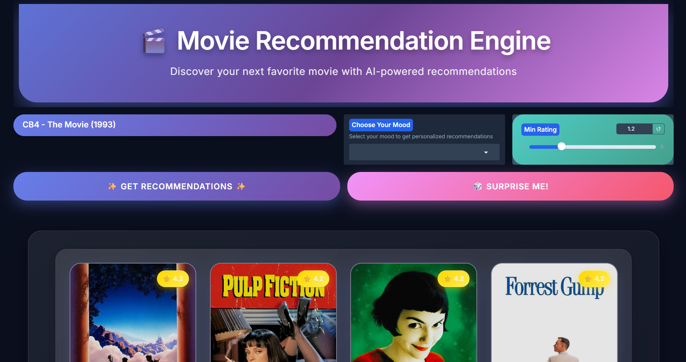
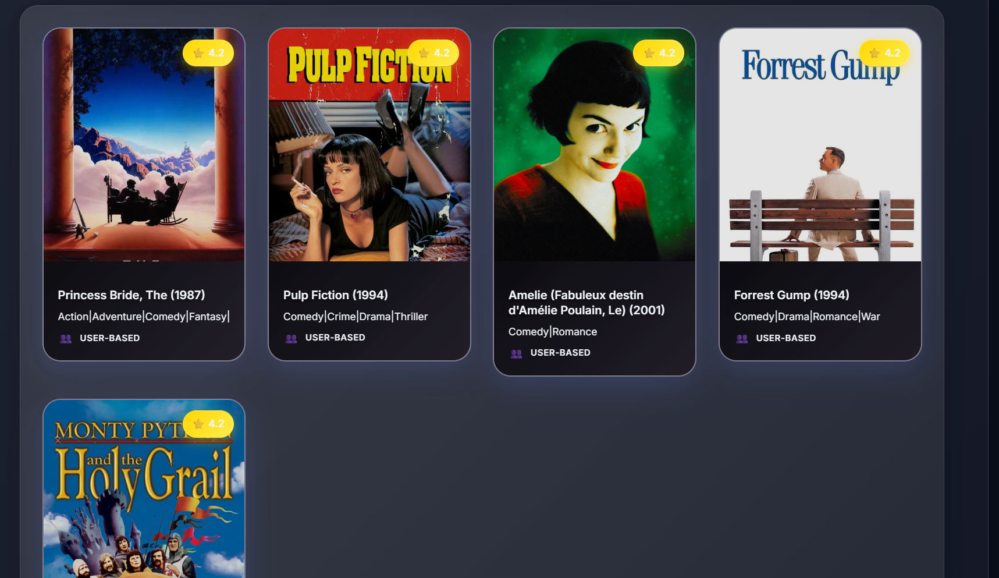

# Movie Recommender System

This project is a movie recommender system built using the MovieLens Small dataset. It leverages semantic search and embeddings to provide personalized movie recommendations. The application features a user-friendly interface built with Streamlit and integrates with the TMDB API for fetching movie details.

## Project Structure

```
movie-recommender
├── src
│   ├── main.py                # Entry point for the application
│   ├── data
│   │   └── movielens_loader.py # Functions to load and preprocess MovieLens datasets
│   ├── embeddings
│   │   └── embedding_utils.py   # Functions to generate and manage movie embeddings
│   ├── semantic_search
│   │   └── search.py            # Implements semantic search functionality
│   ├── tmdb
│   │   └── tmdb_api.py          # Functions to interact with the TMDB API
│   ├── ui
│   │   └── gradio_app.py     # Gradio UI for user interaction
│   └── utils
│       └── helpers.py           # Various helper functions
├── requirements.txt             # Project dependencies
├── README.md                    # Project documentation
└── .env                         # Environment variables (e.g., TMDB API key)
```

## Features

- **Movie Recommendations**: Get personalized movie suggestions based on user input.
- **Semantic Search**: Search for movies using natural language queries.
- **TMDB Integration**: Fetch movie posters and additional information from the TMDB API.
- **User-Friendly UI**: A responsive and visually appealing interface built with gradio.

## Setup Instructions

1. Clone the repository:
   ```
   git clone <repository-url>
   cd movie-recommender
   ```

2. Create a virtual environment and activate it:
   ```
   python -m venv venv
   source venv/bin/activate  # On Windows use `venv\Scripts\activate`
   ```

3. Install the required dependencies:
   ```
   pip install -r requirements.txt
   ```

4. Set up your TMDB API key:
   - Create a `.env` file in the root directory and add your TMDB API key:
     ```
     TMDB_API_KEY=your_api_key_here
     ```

5. Run the application:
   ```
   python src/main.py
   ```
# 🎬 Movie Recommendation Engine  

A content-based movie recommender system with a modern Gradio-powered user interface.  

---
sample images







## 1. 📊 Data Exploration Findings  

- **Dataset Source**: [ TMDB dataset / CSV file].    
- **Key Features Used**:  
  - Title  
  - Genres  
  - Overview/Description  
  - Ratings  

### 🔍 EDA Highlights  
- Distribution of ratings across movies.  
- Most frequent genres (e.g., Drama, Comedy, Action).  
- Popular directors/actors.  
- WordCloud of most common words in movie descriptions.  

*(Add plots/screenshots here later — e.g., genre distribution, ratings histogram)*  

---

## 2. 🤖 Recommendation Logic & Implementation  

### ✅ Approach  
- **Content-Based Filtering**  
  - Used **TF-IDF Vectorizer** on movie overviews.  
  - Computed **cosine similarity** between movie vectors.  

- **Surprise Me! Feature**  
  - Random movie suggestion for exploration.  

### 🔑 Core Implementation  

```python
from sklearn.feature_extraction.text import TfidfVectorizer
from sklearn.metrics.pairwise import cosine_similarity

tfidf = TfidfVectorizer(stop_words='english')
tfidf_matrix = tfidf.fit_transform(movies_df['overview'])
cosine_sim = cosine_similarity(tfidf_matrix, tfidf_matrix)


## Acknowledgments

This project utilizes the MovieLens dataset and the TMDB API for enhanced movie data. Special thanks to the developers of Streamligradio for providing an excellent framework for building interactive applications.
